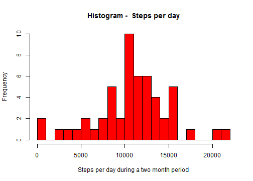
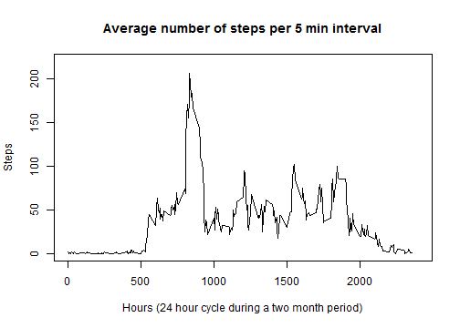
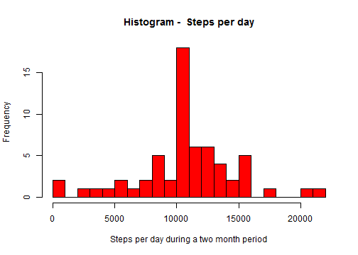

#Reproducible Research Assignment 1#
####Leif Olausson####
####February 2015####

###Background###
This assignment makes use of data from a personal activity monitoring device. This device collects data at 5 minute intervals through out the day. The data consists of two months of data from an anonymous individual collected during the months of October and November, 2012 and include the number of steps taken in 5 minute intervals each day.

###Data###
The data is available at:
https://d396qusza40orc.cloudfront.net/repdata%2Fdata%2Factivity.zip

[Download here](Data available at https://d396qusza40orc.cloudfront.net/repdata%2Fdata%2Factivity.zip)

Variables in the data: steps, date, 5 minute intervals. Dates correspond to October and November 2012. The 5 minute intervals bring the number of rows to 17568.

###Questions/tasks###
The assignment tasks are reported below under headings referring to each task.

###Loading and preprocessing the data###
The loading and processing of the data is reported integrated for each task below. However to also report code for the basic task of loading and preparing a data frame table the following code is shown.

Loading package for managing the data

```r
  library(dplyr)
```

Loading data and showing first 6 rows of data frame.

```r
## Get and manage the data using package dplyr
## Data available at https://d396qusza40orc.cloudfront.net/repdata%2Fdata%2Factivity.zip
  acti <- read.csv("./activity.csv")   # Original data - activity file
  act <-  tbl_df(acti)                 # Data frame table for dplyr applications
  head(act)
```

```
## Source: local data frame [6 x 3]
## 
##   steps       date interval
## 1    NA 2012-10-01        0
## 2    NA 2012-10-01        5
## 3    NA 2012-10-01       10
## 4    NA 2012-10-01       15
## 5    NA 2012-10-01       20
## 6    NA 2012-10-01       25
```

```r
  ## Further processing under each of the following tasks
```

###Total number of steps taken per day###
Calculating the total number of steps each date. Showing first six days.

```r
## Total number of steps per day: mean, median and histogram
## Get and manage the data using package dplyr
## Data available at https://d396qusza40orc.cloudfront.net/repdata%2Fdata%2Factivity.zip
  acti <- read.csv("./activity.csv")
  act <-  tbl_df(acti)
  act_by_date  <-  group_by(act,  date)
## Number of steps each day and calculation of mean and median of steps per day
  step_each_date  <-  summarize(act_by_date,  sum(steps))
  head(step_each_date)
```

```
## Source: local data frame [6 x 2]
## 
##         date sum(steps)
## 1 2012-10-01         NA
## 2 2012-10-02        126
## 3 2012-10-03      11352
## 4 2012-10-04      12116
## 5 2012-10-05      13294
## 6 2012-10-06      15420
```

Calculating the mean and median of the total steps taken per day.

```r
## Calculation of mean and median of steps per day
  meanv <- mean(step_each_date$"sum(steps)",  na.rm = TRUE)
  meanv <- round(meanv, digits = 0)
  medianv <- median(step_each_date$"sum(steps)",  na.rm = TRUE)
  values <- c(meanv, medianv)
  names(values) <- c("Mean", "Median")
  values
```

```
##   Mean Median 
##  10766  10765
```

Here is the histogram of total number of steps per day over the observation period.

```r
## Histogram of total number of steps per day
  hist(step_each_date$"sum(steps)",  breaks = 20,  col = "red",
      main = paste("Histogram - ",  "Steps per day"),
      xlab = "Steps per day during a two month period")
```

 

###Average daily activity pattern###
Calculation of average number of steps per five minute interval as mean across all days disregarding missing values.Showing the result as a time series line plot.

```r
## Average number of steps per five minute interval as mean across all days 
## disregarding missing values
## Get and manage the data using package dplyr
## Data available at https://d396qusza40orc.cloudfront.net/repdata%2Fdata%2Factivity.zip
    acti <- read.csv("./activity.csv")
    act <- tbl_df(acti)
    act<- filter(act, !is.na(act$steps))  
    act_by_int <- group_by(act, interval)
## Average (mean) number of steps in each 5 min interval
    mean_step_int <- summarize(act_by_int, mean(steps))
## Interval with max number of steps (as a mean)
    ##max_int <- mean_step_int[mean_step_int[, 2] == max(mean_step_int[, 2]), ]
    ## print(max_int)  ## 835    206.1698
## Plot average number of steps per 5 min interval with hours on the x axis
    plot(c(0, 2400), c(0, 220), type="n",  
        main = "Average number of steps per 5 min interval",  
        xlab = "Hours (24 hour cycle during a two month period)",  ylab = "Steps")
    lines(mean_step_int)
```

 

Calculating the 5-minute interval with the maximum number of steps (mean across all days).

```r
## Interval with max number of steps (as a mean)
    max_int <- mean_step_int[mean_step_int[, 2] == max(mean_step_int[, 2]), ]
    max_int
```

```
## Source: local data frame [1 x 2]
## 
##   interval mean(steps)
## 1      835    206.1698
```

###Calculation with filled in missing values###

Calculation of the number of missing values.

```r
## Get and manage the data using package dplyr
## Data available at https://d396qusza40orc.cloudfront.net/repdata%2Fdata%2Factivity.zip
    acti <- read.csv("./activity.csv")
    act <- tbl_df(acti)
## Number of missing values
    act_na <- act[is.na(act$"steps")==TRUE, 1]
    no_na <- length(act_na$"steps")
    names(no_na) <- "Missing values"
    no_na
```

```
## Missing values 
##           2304
```

New data set with missing values filled with the calculated mean for each interval (i.e. mean value for each interval across all days leaving the missing values out as performed above). Showing the first six rows of the new data set.

```r
## Average number of steps per five minute interval as mean across all days with 
## missing values filled in using the calculated mean for each interval
## Get and manage the data using package dplyr
## Data available at https://d396qusza40orc.cloudfront.net/repdata%2Fdata%2Factivity.zip
    acti <- read.csv("./activity.csv")
    act <- tbl_df(acti)
## Average (mean) number of steps in each 5 min interval (NAs removed)
    act_no_na<- filter(act, !is.na(act$steps))
    act_by_int <- group_by(act_no_na, interval)
    mean_step_int <- summarize(act_by_int, mean(steps))
## Form new activity data. Missing values replaced by mean of steps for each interval respectively
    act_comb <- cbind(act, mean_step_int)
    act_comb[is.na(act_comb$"steps")==TRUE, 1] <- act_comb[is.na(act_comb$"steps")==TRUE, 5]
    new_act <- tbl_df(act_comb)
    new_act <- new_act[, 1:3]
    head(new_act)
```

```
## Source: local data frame [6 x 3]
## 
##       steps       date interval
## 1 1.7169811 2012-10-01        0
## 2 0.3396226 2012-10-01        5
## 3 0.1320755 2012-10-01       10
## 4 0.1509434 2012-10-01       15
## 5 0.0754717 2012-10-01       20
## 6 2.0943396 2012-10-01       25
```

Histogram of the total number of steps per day during the two month period. Missing values filled in. Compare with histogram shown earlier reflecting the case where the missing values are removed (i.e. not substituted).

```r
## Number of steps each day and calculation of mean and median of steps per day with missing       
## values replaced as described
      act_by_date  <-  group_by(new_act,  date)
      step_each_date  <-  summarize(act_by_date,  sum(steps))
      mean <- mean(step_each_date$"sum(steps)")
      median <- median(step_each_date$"sum(steps)")
      ##print(mean)
      ##print(median)
      ## lika 10766.19
## Histogram of total number of steps per day
      hist(step_each_date$"sum(steps)",  breaks = 20,  col = "red",
           main = paste("Histogram - ",  "Steps per day"),
           xlab = "Steps per day during a two month period")
```

 

Calculating the mean and median of the total steps taken per day.

```r
## Calculation of mean and median of steps per day - see above
  ##meanv <- mean(step_each_date$"sum(steps)",  na.rm = TRUE)
  mean <- round(mean, digits = 0)
  median <- round(median, digits = 0)
  ##medianv <- median(step_each_date$"sum(steps)",  na.rm = TRUE)
  values <- c(mean, median)
  names(values) <- c("Mean", "Median")
  values
```

```
##   Mean Median 
##  10766  10766
```

**Comment:** The mean and median values are in practical terms very close to the values obtained for the case where the missing values were removed. The difference is seen in the histograms. The change is that the cases (days) with high/maximum activity are more pronounced when the missing values are filled in with values reflecting the mean numbers from the case without NAs.
